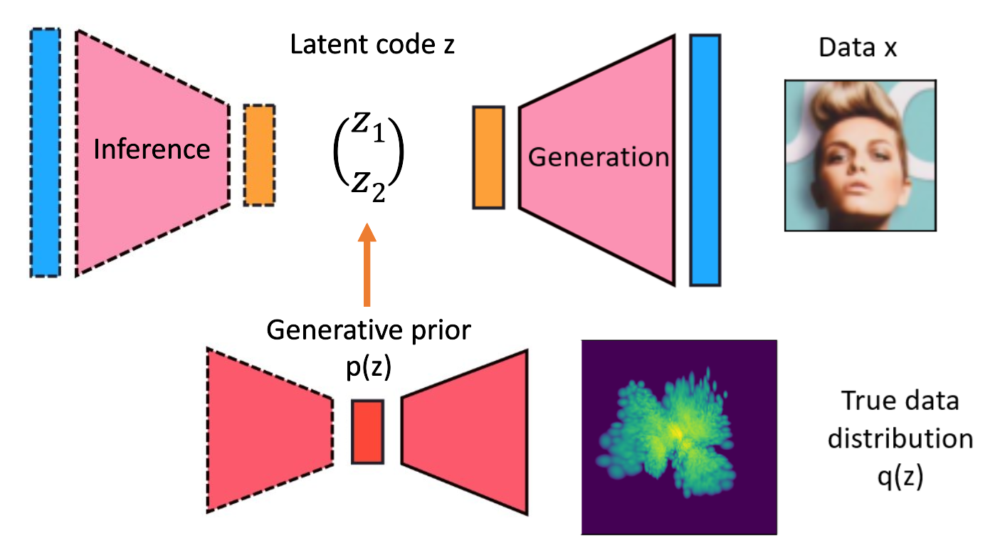
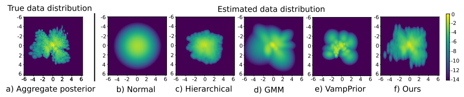

# LaDDer: Latent Data Distribution Modelling (BMVC'20)

This Github repository hosts our code and demos for LaDDer, a method that allows the accurate modelling of the data distribution in the low-dimensional latent space, as proposed in our paper:
<br><br>
[LaDDer: Latent Data Distribution Modelling with a Generative Prior](https://arxiv.org/abs/2009.00088). 
<br>
[Shuyu Lin<sup>1</sup>](https://shuyulin.co.uk/) and [Ronald Clark<sup>2</sup>](http://www.ronnieclark.co.uk)
<br>
<sup>1</sup>University of Oxford, <sup>2</sup>Imperial College London

Usually a fixed prior distribution is adopted to be the data distribution and the encoder is hoped to be powerful enough to transform the high-dimensional data samples (such as images) into a latent space where the data distribute complies with the fixed prior distribution. However, we find this assumption is often overly strict. 

Instead we propose to learn the data distribution (i.e. the prior) directly from data and model the prior as a second generative model. Such a flexible prior model is able to fit with the complex data distribution even in the latent space. An overview of our model is shown below (pls pay attention to the **sophisticated density structure** in the true data distribution visualised from MNIST dataset):



A comparison of the derived data distribution across 5 methods for the MNIST dataset in a 2D latent space is shown below. Please notice the difference between the true data distribution and the commonly used simple Gaussian. This indicates naively using a simple Gaussian as the prior can really limit the generative model's performance. Among the 5 methods, LaDDer gives the most faithful modelling of the true data distribution. For details, please refer to our paper at [link](https://arxiv.org/abs/2009.00088).




## Dataset
We use 3 datasets in this project. 
* MNIST digit (loaded directly from `tf.keras.datasets.mnist`)
* MNIST fashion (loaded directly from `tf.keras.datasets.fashion_mnist`)
* CelebA face dataset 
  * This dataset contains 202599 RGB images of celebrity faces. Dataset can be downloaded from [link](http://mmlab.ie.cuhk.edu.hk/projects/CelebA.html) 
  * We first resize all the images to 128 × 128 and rescale the pixel values to be within [0, 1]. We then randomly select 20k images (about 10%) to be the test set.
  * \[To do\] Add the script to pre-process the downloaded celebA dataset. 
  * \[Not tested\] A loader seems available on tensorflow at this [link](https://www.tensorflow.org/datasets/catalog/celeb_a).


## Environment and libraries needed
Our code is written in Python3 with Tensorflow 1.15 library. Please install the python libraries listed in the `requirements.txt`. We suggest to build a virtual environment using virtualenv package (we named our virtual environment for this project as `ladder-env`). To install and set up virtualenv, please follow the procedures [here](https://packaging.python.org/guides/installing-using-pip-and-virtual-environments/).

Our demo code in `demo/` uses a jupyter notebook. To add the virtualenv `ladder-env` to the notebook kernel, please:
1. Open a terminal and direct to the LaDDer folder.
2. Set up virtualenv `ladder-env` following the previous suggestion. 
3. Activate the virtualenv on the command line: `source ladder-env/bin/activate`
4. Add the virtualenv as a jupyter kernel: `ipython kernel install --name "ladder-env" --user`


## Code structure 
Our code is organised in the following manner. The main codes for running the training and for using a demo for latent space interpolation are at top level and in the files `train.py` and `latent-space-interpolation-mnist.ipynb` respectively.

The codes needed to train LaDDer are all kept in `codes/` folder. The functional codes, such as dataloader, models and trainers, are in python scripts. We use `.json` file to specify model parameters for the training for each dataset. The provided `.json` files contain parameters that work well for our models, but pls feel free to modify different parameters for your interest. 

We also prepare a demo code in jupyter notebook for using the derived data distribution for latent space interpolation. As we proposed in our paper, the knowledge of the data distribution can better facilitate downstream tasks. We propose a method to integrate such knowledge to better interpolate between a pair of images. All the supporting files for the demo is given in `demo/` folder. 

The majorIt only contains a demo for MNIST dataset for now. We will add another demo for CelebA dataset. The generated figures in the demo code will be saved to `figures/` folder for your reference.

We also offer pre-trained models for all three datasets and they are saved in `pretrained_models`. The latent space interpolation demo will need these pre-trained models. 


## Training the models
To start a training, please follow the following procedures:
1. Open a terminal and direct to the LaDDer folder.
2. Activate the virtualenv on the command line: `source ladder-env/bin/activate`
3. Run `python3 train.py --config codes/mnist_digit_config.json`, for example, to start a training for MNIST digit dataset. Please change the `.json` file to others for other datasets. 

The training for MNIST digit and fashion should be able to run without a GPU. Feel free to try. 

The training results (reconstruction plots and generated samples) and trained models will be saved to `experiments/` folder, which will be created the first you started training. 


## Demo code for latent space interpolation tasks
To use our demo code, please:
1. First install all the required libraries, add the virtualenv as a jupyter kernel.
2. Launch a jupyter notebook by calling `jupyter-notebook` on the command line in the project folder. 
3. Open `latent-space-interpolation-mnist.ipynb`.
4. Run the code prepared one cell at a time. The default setting will initiate a latent space interpolation for MNIST digit dataset. 
5. Please feel free to change parameters, such as `n_step`, `n_iter` and start and end image index (`idx_start` and `idx_end`), to see results for different setting. 

\[To add\] `.json` file for MNIST fashion dataset for the interpolation demo and the demo code for CelebA dataset. 


Hope you enjoy playing with our code and find it helpful for your projects! Happy data distribution modelling! 

If you find our codes/project relevant to your work, please cite us in your work:

```
@inproceedings{ladder,
  title={LaDDer: Latent Data Distribution Modelling with a Generative Prior},
  author={Lin, Shuyu and Clark, Ronald},
  booktitle={British Machine Vision Conference (BMVC)},
  year={2020}
}
```


